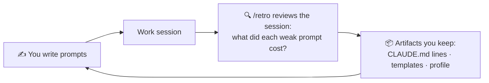
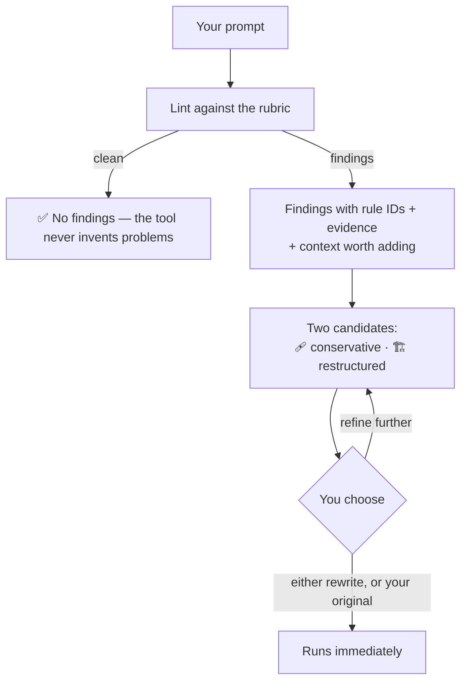
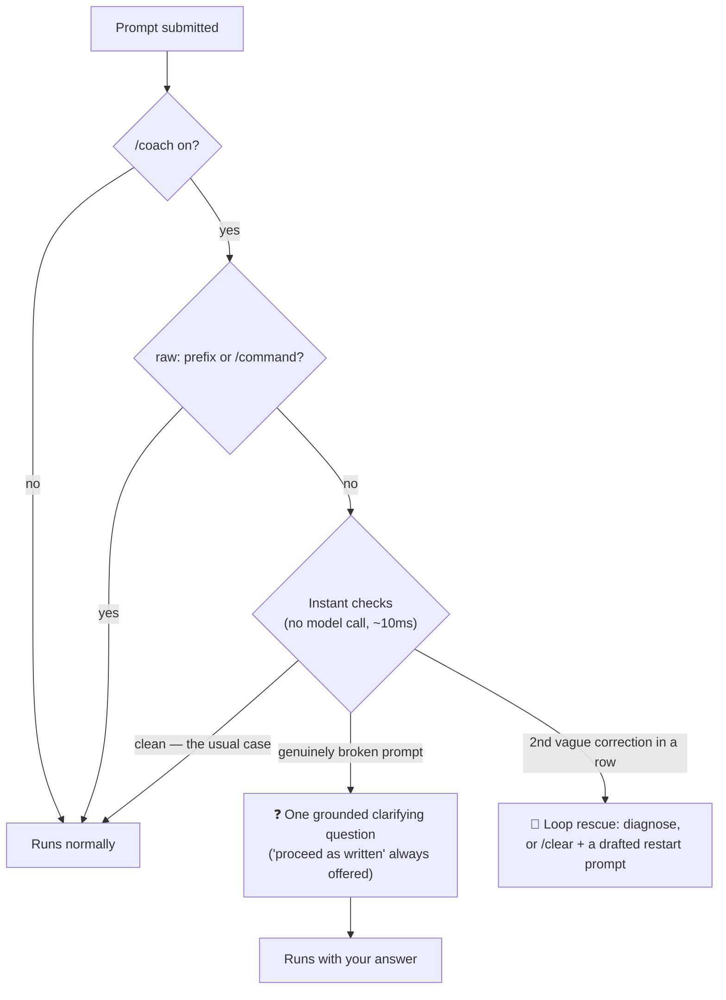

# Prompt Coach

[](LICENSE)
[](.claude-plugin/plugin.json)
[](https://code.claude.com)
[](tests/)

A Claude Code plugin that helps you write better prompts.

It reviews your prompts like a linter reviews code: it names what's weak, explains why it matters, shows you a better version, and lets you choose. It can also review a whole session afterwards and show you the prompt that would have avoided the mess. Everything runs on your machine.

## Contents

- [How it works](#how-it-works)
- [Why Prompt Coach](#why-prompt-coach)
- [Installation](#installation)
- [Quick start](#quick-start)
- [Commands at a glance](#commands-at-a-glance)
- [Commands](#commands)
  - [/improve](#improve)
  - [/retro](#retro)
  - [/templatize](#templatize)
  - [/audit](#audit)
  - [/coach (always-on gate)](#coach-always-on-gate)
- [Team house rules](#team-house-rules)
- [Configuration](#configuration)
- [Data and privacy](#data-and-privacy)
- [Project layout](#project-layout)
- [Contributing](#contributing)
- [License](#license)

## How it works

The core idea: a rewritten prompt helps once — a changed habit, a saved template, or a fixed CLAUDE.md helps every session after it. Prompt Coach is built as a loop that turns wasted sessions into durable assets:



In the moment, `/improve` fixes a single prompt before you spend a session on it. Afterwards, `/retro` shows what the weak prompts cost and what to keep. In the background (optional), `/coach on` quietly catches the genuinely broken ones.

## Why Prompt Coach

Vague prompts waste sessions: the model guesses, you correct it, tokens burn, and next week you make the same mistake again. Four principles set this tool apart from similar ones:

- 👁️ **Nothing is silent.** Every suggestion is shown and explained. You always choose; the original is always an option.
- 🧾 **Findings, not grades.** Named lint rules with evidence, like a code linter — never a made-up "prompt score: 74/100".
- 📊 **Grounded in what actually happened.** Session reviews point at what a weak prompt really cost (corrections, errors, wasted tokens), not at abstract rules.
- 🔒 **Everything stays local.** No accounts, no servers, no telemetry.

## Installation

In Claude Code:

```
/plugin marketplace add itsAmirhossein/prompt-coach
/plugin install prompt-coach@prompt-coach
```

Then restart Claude Code. Requires `python3` on PATH (present by default on macOS and Linux).

Installing from a local checkout works the same way: `/plugin marketplace add /path/to/prompt-coach`.

## Quick start

Three things to try in your first 15 minutes:

1. **See the mechanics** — type `/improve fix the auth bug`. You'll get findings, then two rewrites to pick from.
2. **The main event** — go to a project where a session went badly and run `/retro --list`. Pick the messy session.
3. **Optional** — turn on the background gate with `/coach on`. It stays silent unless a prompt is genuinely broken.

## Commands at a glance

| Command | One line |
|---|---|
| [`/improve`](#improve) | Critique one prompt, pick from two rewrites |
| [`/retro`](#retro) | Review a session; keep what you learn |
| [`/templatize`](#templatize) | Save repeated prompts as fill-in templates |
| [`/audit`](#audit) | Lint CLAUDE.md and context files |
| [`/coach`](#coach-always-on-gate) | Background gate for broken prompts (off by default) |

## Commands

### /improve

Reviews one prompt and offers two rewrites.

```
/improve <paste any prompt>          critique + two rewrite candidates
/improve --last                      review the prompt you just sent
/improve --file prompts/system.md    lint a saved prompt file
/improve --target claude-fable-5     check an old prompt against a newer model
/improve --test                      A/B-run original vs rewrite on a sample input
```



What a run looks like:

```text
> /improve add error handling to the api

Findings
  [CLR04 warn] Ambiguous scope — evidence: "the api" — every endpoint or a
               specific one? Wrapper middleware or per-route?
  [CON02 warn] Missing constraint — how should errors surface: JSON error
               body? Logged? Retried?

Context worth adding
  • Which endpoints (or "all under src/routes/")
  • Your error response shape, if one exists

Candidates
  🩹 Conservative — "Add error handling to the Express routes under
     src/routes/: wrap async handlers, return {error, code} JSON, log with
     the existing pino logger."
  🏗️ Restructured — Goal / Where / Constraints / Verify shape …

Use conservative · Use restructured · Keep original · Refine further
```

The *conservative* candidate keeps your wording and fixes only what's flagged; the *restructured* one rebuilds the prompt in best-practice shape. Both come with per-change explanations, and a `--target <model>` run reports only what breaks on that model generation (for example, prefill prompts hard-fail on Claude 4.6+).

### /retro

Reviews a whole session and turns the findings into things you keep.

```
/retro                    review the current session
/retro --list             pick from recent sessions
/retro --session <id>     review a specific session
```

The report contains:

- **A prompt-by-prompt review** — only for prompts that caused real trouble, each tied to its cost ("led to 3 corrections", "~38k tokens spent recovering"). Prompts that worked are left alone.
- **Your top 2 recurring habits** — two, not ten, because coaching that lists everything teaches nothing.
- **🎯 The counterfactual opening prompt** — the centerpiece: the prompt that would have made the session short, built from everything the session eventually established.
- **A progress check** — if a habit from your last retro didn't recur, it says so.
- **Artifacts, on your confirmation only** — lines for CLAUDE.md, a reusable template if you repeat a prompt shape, and updates to your personal profile so future coaching gets sharper.

### /templatize

Saves prompts you write repeatedly as fill-in templates.

```
/templatize --last               turn your previous prompt into a template
/templatize <paste a prompt>     same, from pasted text
/templatize --list               show your template library
/templatize --use <name>         fill in a saved template and run it
/templatize --from-examples      build a prompt from 2-3 input→output examples
```

Templatizing separates what stays the same (the task, rules, format) from what changes each time — the changing parts become `{{VARIABLES}}`. Templates live in `~/.claude/prompt-coach/templates/` as plain markdown files.

`--from-examples` is for "I can show you what I want but can't describe it": give it a few input→output pairs and it works out the instruction, then verifies the draft reproduces your examples.

### /audit

Lints CLAUDE.md and other context files. A defect in CLAUDE.md is a defect in every future session.

```
/audit                    ./CLAUDE.md, ./CLAUDE.local.md, .claude/*.md
/audit --global           also include ~/.claude/CLAUDE.md
/audit path/to/file.md    audit specific files
```

What it finds:

| Check | Example |
|---|---|
| Contradictions (within and across files) | "always use npm" … "install with pnpm" |
| Stale references (checked mechanically) | a rule pointing at a deleted `scripts/deploy_old.sh` |
| Duplicated rules | the same rule in CLAUDE.md and .claude/rules.md, drifting apart |
| Pressure language | `IMPORTANT: YOU MUST NEVER…` (causes over-triggering on Claude 4.5+) |
| Uncheckable rules | "write clean code", "be careful with the database" |
| Derivable content | directory listings the model can already see |
| Misplaced automation | "after every edit run X" — belongs in a hook, not prose |

Fixes are proposed as small before/after edits and applied only if you approve them.

### /coach (always-on gate)

An optional background check on every prompt you send. **Off by default.**

```
/coach on                 enable
/coach off                disable
/coach status             show current settings
/coach config <key> <value>
```



The details that keep it tolerable:

- **Silent almost always** — it reacts only to high-confidence problems: "fix it" with no target, "it doesn't work" with no error.
- **When it fires**, Claude first checks whether the repo or conversation already makes your meaning clear; only then does it ask — one question, never a lecture. It never blocks or rewrites your prompt.
- **Loop rescue** — after two vague corrections in a row ("no, still wrong" → "still broken"), instead of a third blind attempt Claude diagnoses what's going wrong and, if needed, suggests `/clear` with a ready-made restart prompt.
- **Escape hatches** — `raw:` prefix bypasses once; at most 3 interventions per session; `/coach off` ends it all.
- **Optional precision boost** — `/coach config stage2 true` adds a fast Haiku call that cancels the intervention when your prompt is probably clear from context (a few seconds of latency, on flagged prompts only).

## Team house rules

Commit a `.claude/prompt-coach.md` file to any repo to add project-specific lint rules. `/improve` and `/retro` apply them like built-in rules, and they win on conflict. One rule per bullet, each checkable, with a reason:

```markdown
- Prompts asking for DB changes must name the migration tool (we use dbmate, not raw SQL) — mixed tooling has burned us twice.
- Bug reports must include the request ID from Sentry.
```

## Configuration

Settings live in `~/.claude/prompt-coach/config.json`, managed by `/coach config`:

| Key | Default | Meaning |
|---|---|---|
| `enabled` | `false` | The always-on gate |
| `threshold` | `"error"` | `"warn"` also fires on style-level rules |
| `max_triggers_per_session` | `3` | Lint intervention cap per session |
| `bypass_prefix` | `"raw:"` | Prefix that skips the gate once |
| `loop_rescue` | `true` | Detect correction loops |
| `max_loop_rescues_per_session` | `1` | Loop-rescue cap per session |
| `stage2` | `false` | Haiku verification of gate fires |
| `stage2_command` | `claude --model haiku -p` | The verifier command (edit by hand) |

## Data and privacy

Everything stays on your machine. `/retro` reads your local session transcripts (`~/.claude/projects/…`), which may contain code and secrets — nothing is sent anywhere beyond your normal Claude session. Plugin state lives in `~/.claude/prompt-coach/`:

| Path | Contents |
|---|---|
| `config.json` | Gate settings |
| `profile.md` | Your recurring patterns, written by `/retro` |
| `templates/` | Your template library |
| `feedback.jsonl` | Which rewrites you picked |
| `state/` | Per-session trigger counters |

Review any artifact before committing it to a shared repo.

## Project layout

- `skills/prompt-improve/rubric/` — **the product**: the lint catalog (`core.md`), model-era rules pinned to Claude 4.x (`model-claude-4x.md`), and overlays per prompt type (one-shot / agentic / template) and domain (SWE / research / writing). Rules are data, not code.
- `skills/prompt-retro/`, `skills/prompt-templatize/`, `skills/prompt-audit/` — the command procedures.
- `scripts/parse_transcript.py` — read-only transcript parser (prompts, outcomes, token usage).
- `hooks/gate.py` — the always-on gate (deterministic, fail-open, zero model calls unless stage 2 is on).
- `tests/` — 34 deterministic gate tests (`python3 tests/test_gate.py`), a 40-case labeled golden set for the rubric, and a planted-defect CLAUDE.md fixture for grading `/audit`.

Design rationale, competitive research, and roadmap: [DESIGN.md](DESIGN.md).

## Contributing

The highest-value contributions are rubric improvements — new rules, better wording, false-positive fixes. The rule: **no rubric change ships without a golden-set run before and after** (see [tests/README.md](tests/README.md)); when recall and false-positive rate conflict, false positives win. Found a miss or a false positive in real use? Add it to the golden set first, then fix the rubric against it.

## License

[MIT](LICENSE) © Amirhossein Jahanshahi
